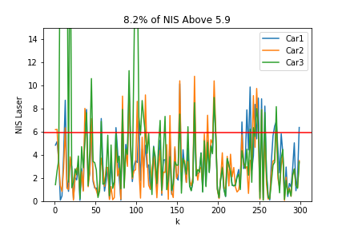
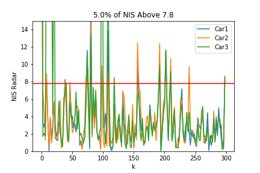

# Unscented Kalman Filter Project

### This repository contains the completed project for the final lesson of the sensor fusion nanodegree on Udacity.com.

#### Program

Program was completed by filling out the ukf (unscented Kalaman filter) class contained in ukf.cpp and ukf.h. Constant turn rate and velocity magnitude model (CTRV), with a state dimension of 5 df. Three functions were created to handle the Kalman filtering, prediction, update lidar and update radar. Both the prediction and the radar update step use the unscented (sigma point) approach, as these involve non-linear functions. The lidar update step uses the regular Kalman filter and update.

#### Performance Summary

As can be seen by running the executable, the root means square (RMSE) error remains below [0.30, 0.16, 0.95, 0.70] for the entirety of the program. In addition, the normalized innovation squares are calculated for both laser and radar, and compared to the chi squared 95% cutoff for 2 and 3 df respectively. Parameters chosen here are standard deviation of acceleration of 3 m/s2, and standard deviation of yaw derivative of 1 radians/s2.

